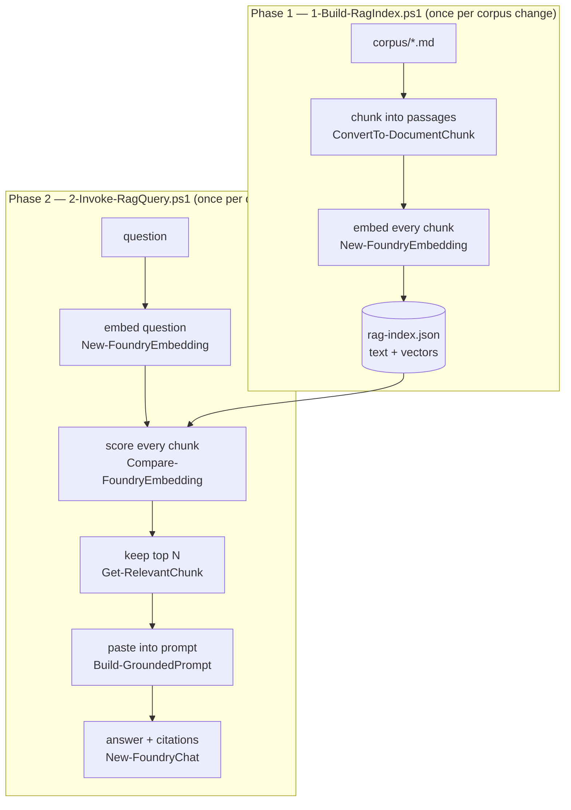

# RAG with PowerShell and Foundry Local

A worked example of **Retrieval-Augmented Generation** built entirely from PwshFoundry cmdlets. It is written to be *read*, not just run: every stage prints a verbose message to see what is happening, and helper functions are in the sample folder not  hidden behind a cmdlet.
**This is not a production grad RAG, this is an educational demo.**

## The problem RAG solves

A local model knows only what it saw during training. It has never seen your internal documents, it cannot know anything that happened after its cutoff, and it cannot tell you where an answer came from. Asked about your VPN policy, a model will usually produce a confident, plausible, entirely invented answer.

You could fine-tune a model on your documents, but that is expensive, has to be redone whenever a document changes, and still gives you no citations.

RAG takes the other route: **leave the model alone and fix the prompt.** Find the passages that are actually relevant to the question, paste them into the prompt, and instruct the model to answer only from them. The model stops being a knowledge store and becomes what it is good at; a reader that turns relevant text into a fluent answer.

## Why the corpus is fictional

`corpus/` describes an invented company. The VPN client, the expense thresholds, the on-call rate, none of it exists, so no model can know any of it from pretraining.

Because the facts are invented, a correct answer can *only* have come from retrieval. Run `2-Invoke-RagQuery.ps1 -CompareWithoutRag` to see the same model answer the same question with and without the retrieved context.

## The pipeline

RAG has two phases that run at completely different times. Embedding is slow, so the corpus is embedded **once**, offline; queries then reuse that index.



### Stage by stage

| Stage | What happens | Implemented by |
|---|---|---|
| **Chunk** | Markdown markup is stripped, then documents are split into ~120-word passages at paragraph boundaries, with 25 words of overlap. | `ConvertTo-DocumentChunk` (`RagHelpers.psm1`) |
| **Embed** | Each chunk becomes a vector. Chunks are sent in batches, not one request each. | `New-FoundryEmbedding` |
| **Store** | Vectors are saved *with their text* — retrieval finds the vector, but the text is what gets pasted into the prompt. | `1-Build-RagIndex.ps1` |
| **Retrieve** | The question is embedded, then scored against every chunk by cosine similarity; the best few win. | `Compare-FoundryEmbedding` via `Get-RelevantChunk` |
| **Augment** | Retrieved chunks go into the prompt as numbered blocks, with instructions to use only those blocks and cite them. | `Build-GroundedPrompt` |
| **Generate** | The model answers from the supplied context at low temperature. | `New-FoundryChat` |

### Why chunk at all?

An embedding turns a passage into *one* vector. Embed a whole document and you get the average of everything it discusses, which matches every question weakly and no question well. Chunking keeps roughly one idea per vector.

The overlap matters too. Without it, a fact that straddles a boundary — `...director sign-off is required above` | `500 EUR...` — is destroyed in both chunks. 25 words of overlap means boundary-spanning facts survive in at least one chunk.

Markup is stripped before chunking for the same reason. `**30 days**` costs the same in noise twice over: it perturbs the embedding, and it makes the text harder for the model to quote back cleanly.

### Why the same embedding model on both sides

Vectors from different models live in different spaces and are not comparable. The failure is nasty because nothing crashes: cosine similarity still returns numbers, they are just meaningless. `2-Invoke-RagQuery.ps1` records the model in the index and refuses to run if the query model differs.

## Running it

```powershell
# Phase 1 — build the index (slow; embeds the whole corpus)
./1-Build-RagIndex.ps1

# Phase 2 — ask a question whose answer is in exactly one document
./2-Invoke-RagQuery.ps1 -Question 'How long can a SecureLink Guest profile last?'

# See the exact prompt the model receives, and what it answers without retrieval
./2-Invoke-RagQuery.ps1 -Question 'What is the on-call weekly rate?' -ShowContext -CompareWithoutRag

# Interactive
./2-Invoke-RagQuery.ps1
```

Both scripts take `-EmbeddingModel` and `2-Invoke-RagQuery.ps1` takes `-ChatModel`; the defaults assume `qwen3-embedding-8b-generic-gpu` and `qwen2.5-0.5b-instruct-generic-cpu` are in your local cache. Substitute anything from `Get-FoundryModelCache` — `qwen3-embedding-0.6b` is a much faster embedding choice if you have it, and `-ChatModel Phi-3-mini-4k-instruct-generic-cpu` produces better citations at the cost of speed.

Building the index takes a few minutes: the 8B embedding model is slow, and every chunk has to go through it. Querying is fast afterwards, which is the whole reason the two phases are separate. `rag-index.json` is generated and gitignored — rebuild it rather than committing it.

Good questions to try, each answerable from exactly one document:

- *How long can a SecureLink Guest profile last?* (`vpn-policy.md`)
- *What expense amount needs director sign-off?* (`expense-policy.md`)
- *How quickly must an on-call page be acknowledged?* (`oncall-rotation.md`)
- *How long does a canary run before traffic increases?* (`deployment-standards.md`)
- *How long is Tier-0 data retained?* (`data-classification.md`)

And one that is deliberately outside the corpus, to watch retrieval refuse:

- *What is the capital of Portugal?*

## The knobs

| Knob | Default | Too low | Too high |
|---|---|---|---|
| `-MaxWords` | 120 | Facts get separated from the context that explains them | Each vector averages several topics and matches nothing precisely |
| `-OverlapWords` | 25 | Facts spanning a boundary are lost from both chunks | Index bloats with duplicated text; near-identical chunks crowd the results |
| `-TopN` | 3 | The chunk holding the answer may not make the cut | Prompt fills with weakly related text that distracts the model |
| `-MinScore` | 0.3 | Off-topic questions get answered from irrelevant context | Legitimate questions are refused |
| `-BatchSize` | 8 | More round trips than necessary | A single request can exceed the 120-second API timeout |
| `-Temperature` | 0.1 | — | The model starts embellishing rather than reporting what the context says |

Thresholds are corpus- and model-specific. `0.3` suits this corpus with these models; check the printed scores before trusting it elsewhere.

## What this deliberately simplifies

This is a teaching sample. A production system would differ in most of these ways:

- **Linear scan.** Every query scores every chunk. Fine for 21 chunks, hopeless past a few thousand — real systems use an approximate nearest-neighbour index (FAISS, HNSW, pgvector) or a vector database rather than a JSON file.
- **No re-ranking.** Strong systems retrieve ~50 candidates cheaply, then re-score them with a cross-encoder that reads question and chunk *together*. Cosine similarity on independently-computed vectors is a coarse first pass.
- **No query rewriting.** The user's words are embedded as typed. Real systems expand abbreviations, split multi-part questions, and rewrite follow-ups ("what about contractors?") into standalone queries.
- **No hybrid search.** Vectors miss exact identifiers — error codes, product SKUs. Production retrieval usually blends keyword search (BM25) with vector search.
- **Retrieval ignores conversation history.** Each question is embedded alone, so follow-ups that depend on the previous turn retrieve poorly. Pair with `New-FoundryChatContext` and rewrite the question before embedding.
- **No chunk deduplication or freshness.** Repeated boilerplate can occupy several of the top slots, and nothing tracks which document version a chunk came from.
- **No query instruction prefix.** The Qwen3 embedding models are trained to take an instruction prefix on the *query* side (`Instruct: <task>\nQuery: <text>`) while documents are embedded bare. Using it typically buys a few points of retrieval accuracy; this sample embeds both sides plainly to keep the symmetry obvious.
- **Citations are not verified.** The model is asked to cite its blocks, but nothing checks that the cited block actually supports the claim.

## Telling retrieval failures from generation failures

Retrieval and generation fail in different ways, and the printed scores are how you tell them apart. This sample earned that lesson the hard way.

An early version answered *"How long can a SecureLink Guest profile last?"* with **"7 days"**. The document says 30. It was tempting to blame retrieval — but the scores showed the chunk containing *"limited to a maximum of 30 days"* ranked **#1**. Retrieval had done its job perfectly. The model was reading the right passage and picking the wrong number out of it, misled by a nearby sentence about a *"renewal reminder seven days before expiry"*.

Two things fixed it, both on the generation side:

1. **Stripping the markdown.** The passage read `a maximum of **30 days**`. Those asterisks are noise in the text the model has to quote from.
2. **Reordering the system prompt.** The original led with *"if the context does not contain the answer, reply ..."*. A prominent early refusal instruction makes small models refuse — one model started answering *"The provided documents do not answer that question."* about a document that plainly answered it. Putting the instruction to *answer* first, and the refusal last, resolved it.

Both models now answer correctly. The lesson generalises: when an answer is wrong, read the retrieval scores before touching the retrieval code. If the right chunk ranked first, the bug is in your prompt, not your embeddings.

One real difference does remain between model sizes: `Phi-3-mini` returns *"a maximum of 30 days ... [1]"* with the citation the prompt asked for, while `qwen2.5-0.5b` returns *"approximately 30 days"* and omits the citation. Correct either way, but citation discipline improves with model size.

